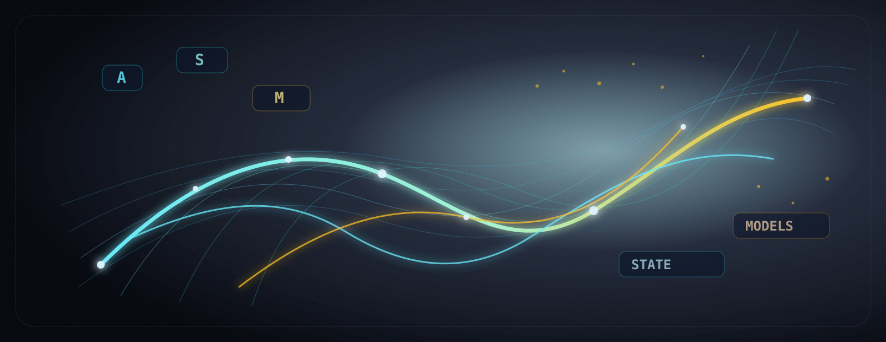

# 🚨 AVISO CRÍTICO DE SEGURANÇA — NÃO ESCALE NEM IMPLANTE O ASM

> [!CAUTION]
> **NÃO ESCALE ESTES MODELOS. NÃO OS COLOQUE EM PRODUÇÃO, AGENTES AUTÔNOMOS OU
> SISTEMAS CRÍTICOS.** O ASM é código experimental de pesquisa, sem alinhamento.
> Não foi demonstrado que ele seja seguro, governável, controlável ou
> interpretável de forma confiável. Até que evidência independente demonstre o
> contrário, toda variante ASM deve ser tratada como **difícil de governar e um
> possível risco de segurança**.

O [resultado ATTR-RTG registrado](docs/benchmarks/attr_rtg/README.md) e concluído
**não** demonstrou governança eficaz. Apenas `Transformer.RTG1-Z` passou; todos
os gates registrados de governança RTG2 e de generalização RTG3 em shift/OOD
falharam. O governor gerativo `G` testado reduziu outcomes inseguros em
exatamente **0%** nesse benchmark. O resultado foi limitado ao ASM-X e não prova
que toda variante ASM seja insegura, mas **não fornece base para afirmar que o ASM é seguro para escalar ou
implantar**. A evidência ATTR-RTG-RCMZ posterior
também é local, tem um único administrador e não foi atestada de forma
independente. Todas as 40 células de governança shift/OOD e todos os seis
contrastes entre modelos são inválidos; isso não é uma certificação de
segurança.

Os modelos ASM comprimem o histórico em um estado recorrente persistente.
Algumas variantes também usam memória associativa gravável, seletiva ou de
fast weights. Estados, direções, gates, métricas e escores de risco aprendidos
não são intenções legíveis, garantias de política ou barreiras de segurança. O
estado e a memória persistentes podem tornar o comportamento, influências
retidas e falhas sob mudança de distribuição difíceis de inspecionar, remover,
conter ou controlar. Presuma riscos ainda não resolvidos, incluindo prompt
injection, envenenamento de estado ou memória, retenção indevida ou influência
entre sessões, saídas inseguras e comportamento inesperado fora da distribuição
de treino.

**Não use o ASM** para execução autônoma de ferramentas, acesso privilegiado,
processamento de segredos ou dados pessoais sensíveis, decisões de segurança,
infraestrutura crítica, armas, vigilância ou decisões médicas, jurídicas,
financeiras ou de outro alto impacto. Qualquer pesquisa deve ocorrer, se ocorrer,
em sandbox isolado, com privilégio mínimo, sem segredos embutidos, reset estrito
do estado e isolamento por sessão, controles de entrada e saída, limites de
recursos, monitoramento contínuo, avaliação adversarial, aprovação humana para
toda ação com consequência e um mecanismo independente de desligamento. Essas
precauções reduzem riscos; elas não demonstram segurança.

**Baixar, copiar, treinar, fazer fine-tuning, escalar, modificar, distribuir,
integrar ou usar qualquer código, peso, checkpoint, derivado ou saída do ASM é
uma decisão tomada inteiramente por conta e risco de quem o fizer. Essa pessoa
ou entidade assume responsabilidade exclusiva por threat modeling, privacidade,
segurança, controle de acesso, conformidade legal e regulatória, decisões de
implantação, monitoramento, resposta a incidentes, danos e todas as demais
consequências dessas atividades.** No limite máximo permitido pela lei
aplicável, o autor, titular dos direitos autorais, mantenedores e contribuidores
não fornecem garantias nem assumem responsabilidade decorrente dessas
atividades. Nada neste repositório constitui autorização, recomendação,
aprovação de segurança ou declaração de adequação para qualquer finalidade. Este
aviso complementa, e não substitui, os termos de garantia e responsabilidade da
[licença](LICENSE).

---

# ASM — Aletheion State Models

**Uma família experimental de modelos de estado causais sem attention, derivada
do DRM e selecionada por ablações e evidência de scaling.**



[](pyproject.toml)
[](pyproject.toml)
[](ARCHITECTURE.md)
[](tests/test_no_transformer.py)
[](LICENSE)

ASM investiga geração de linguagem como evolução de um estado causal
persistente. A família reúne geometria DRM explícita, transições diretas
condicionadas por métrica, controles sem geometria e modelos de memória
seletiva no mesmo protocolo reproduzível.

Este repositório chamava-se **DRM Language Emitter**. DRM agora identifica a
teoria e a variante geométrica explícita **ASM-X**; a família pública pode
seguir a arquitetura que sobreviver às ablações e à scaling law.

Este repositório é uma infraestrutura de pesquisa. Não é um modelo de produção
e não sustenta uma alegação geral de superioridade sobre Transformers ou world
models.

Versão principal em inglês: [README.md](README.md).

## Autoria e licenciamento

Copyright © 2026 Felipe Maya Muniz. ASM — Aletheion State Models e seu código
fonte original foram criados por Felipe Maya Muniz e derivados de sua pesquisa
em Directional Relational Manifolds. O projeto é distribuído sob
AGPL-3.0-only, com licenciamento comercial alternativo disponível diretamente
com o titular dos direitos mediante contrato escrito e assinado. Consulte
[NOTICE](NOTICE), [COPYRIGHT](COPYRIGHT) e
[LICENCE-COMMERCIAL.md](LICENCE-COMMERCIAL.md).

O projeto não aceita contribuições externas não solicitadas. Parcerias
financiadas de pesquisa, integração ou desenvolvimento poderão ser avaliadas
somente mediante contrato comercial escrito e não concedem participação
societária, royalties, propriedade, autoria ou governança implícitas; veja
[CONTRIBUTING.md](CONTRIBUTING.md). As identidades autorais estão registradas
em [AUTHORS.md](AUTHORS.md) e `.mailmap`. Builds comerciais devem seguir a
[política de distribuição comercial](docs/commercial_distribution.md).

Materiais de terceiros e contribuições externas, quando existirem, preservam
seus respectivos avisos e termos de licenciamento.

## Links rápidos

- [Arquitetura em português](ARCHITECTURE_ptbr.md)
- [Família ASM](docs/MODEL_FAMILY_ptbr.md)
- [Filosofia DRM e reavaliação](docs/drm_philosophy_ptbr.md)
- [Histórico e mudança de nome](HISTORY.md)
- [Arquitetura em inglês](ARCHITECTURE.md)
- [Roadmap formal em português](roadmap_ptbr.md)
- [Roadmap formal em inglês](roadmap.md)
- [Paper DRM v6](docs/paper/drm_v6.tex)
- [Notas matemáticas](docs/math.md)
- [Protocolo de competição](docs/competition.md)
- [Metodologia e FAQ técnico](docs/TECHNICAL_QA_ptbr.md)
- [Artefatos de benchmark](docs/benchmarks/README.md)
- [Índice cronológico dos scripts](scripts/INDEX.md)
- [Model card](MODEL_CARD.md)
- [Limitações](docs/limitations.md)
- [Referência da API](docs/api.md)
- [Checklist de conformidade](docs/compliance_checklist.md)
- [Licenças e proveniência de dados](docs/third_party_licenses.md)

## O que diferencia o ASM

As variantes ASM atuais não usam:

- blocos Transformer;
- self-attention;
- attention Q/K/V;
- `nn.MultiheadAttention`;
- KV cache.

O caminho recorrente básico é:

```text
token e_t
  → estado latente z_t
  → direções D(z_t)
  → gates direcionais a_i(z_t)
  → métrica G(z_t) = diag + U Uᵀ
  → velocidade dz no span das direções
  → estado z_{t+1}
  → logits
```

O modelo promovido é **ASM-CM — Aletheion Compact Memory Model**. Sua linhagem
técnica permanece `ASM-C2-FW-LM`: ASM-R especializado com memória associativa
fast-weight limitada, treinamento misto de linguagem/MQAR, destilação e núcleo
recorrente em FP32. O rescoring congelado pós-correção em três seeds produziu
CE médio **1,328496 ± 0,000687**; no decode compacto em 32K, o estado permaneceu
em **143.360 bytes**, a VRAM em **363,66 MiB** e o throughput em **80,68 tok/s**.
O Transformer pareado continua sendo o controle superior de CE geral.

```text
input_ids
  → TokenEmbedding
  → blocos causais de 64 tokens
  → deltas direcionais paralelos
  → prefix cumsum
  → causal local mixer
  → residual token→estado
  → memória seletiva forget/write
  → LanguageEmitter
  → logits
```

Essa arquitetura continua autoregressiva: tokens futuros não podem alterar os
logits ou estados do prefixo. Existem testes específicos de causalidade.

## Instalação

```bash
pip install -e .
```

Ferramentas de desenvolvimento:

```bash
pip install -e ".[dev]"
```

O projeto funciona em CPU para testes pequenos. CUDA é recomendada para os
benchmarks memmap de 125M parâmetros.

## Início rápido

Treinar um modelo DRM pequeno:

```bash
python scripts/train_tiny.py --config configs/tiny.yaml --text data/tiny.txt
```

Gerar texto:

```bash
python scripts/generate.py \
  --checkpoint runs/tiny/drm_tiny.pt \
  --prompt "DRM "
```

Executar diagnósticos geométricos:

```bash
python scripts/eval_geometry.py --checkpoint runs/tiny/drm_tiny.pt
python scripts/eval_geodesic_paths.py --checkpoint runs/tiny/drm_tiny.pt
```

Se `data/tiny.txt` não existir, o treinamento pequeno cria um corpus mínimo.
O tokenizer padrão opera sobre bytes UTF-8.

## Família arquitetural

| Código | Arquitetura | Variante experimental |
|---|---|---|
| ASM-X | Explicit DRM State Model | J |
| ASM-U | Metric Subspace State Model | J_METRIC_SUBSPACE |
| ASM-F | Relational Frame State Model | J_METRIC_ORTHONORMAL_DIRECTION |
| ASM-R | Relational State Model | J_NO_DIRECTION |
| ASM-C | Compact State Model | pesos ASM-R + inferência streaming compacta |
| ASM-C2 | Compact Addressable State Model | ASM-C + slots limitados de chave/valor |
| ASM-C2-FW | Compact Fast-Weight State Model | ASM-C + matriz associativa limitada com regra delta |
| ASM-CM | Aletheion Compact Memory Model | nome público promovido do ASM-C2-FW-LM |
| ASM-D | Direct State Model | J_DIRECT_CONTROL |
| ASM-S | Selective State Model | J_DIRECT_CONTROL_MATCHED |
| ASM-M | Causal Memory State Model | SSM_CONTROL |

Leia [MODEL_FAMILY_ptbr.md](docs/MODEL_FAMILY_ptbr.md) para definições e
critérios de promoção.

A primeira validação do ASM-C manteve cache (`6.144 B`), pico de alocação CUDA
(`387,53 MiB`) e throughput (`~503 tok/s`) praticamente constantes até 32K,
atingindo `2,97x` o throughput streaming do caminho ASM-R anterior em 32K. O
controle curto de MQAR falhou (`32,25%` contra o gate de `80%`); portanto, a
memória associativa de longo alcance ainda não foi demonstrada. Veja o
[benchmark ASM-C versionado](docs/benchmarks/asm_c_streaming_32k/README.md).

## Componentes principais

- `src/aletheion_state_models/core/`: interfaces neutras de estado, transição, memória, mixer e emitter.
- `src/aletheion_state_models/geometry/`: métrica, base direcional e naturalização opcionais.
- `src/aletheion_state_models/variants/`: construtores nomeados ASM-X, ASM-U, ASM-F, ASM-R, ASM-C, ASM-C2, ASM-C2-FW, ASM-D, ASM-S e ASM-M.
- `src/drm_language_emitter/`: implementação legada compatível com checkpoints durante a migração.

- `src/drm_language_emitter/config.py`: schema validado do `DRMConfig`.
- `src/drm_language_emitter/model.py`: montagem do modelo e forward recorrente principal.
- `src/drm_language_emitter/model_components.py`: inicializador, mixer causal, transição direta de controle e memória seletiva.
- `src/drm_language_emitter/selective_control.py`: controle de memória seletiva sem geometria.
- `src/drm_language_emitter/mqar.py`: dados sintéticos de associative recall.
- `src/drm_language_emitter/direction_field.py`: campos direcionais ativos e gates.
- `src/drm_language_emitter/metric.py`: métrica relacional `diag + U Uᵀ` e naturalização.
- `src/drm_language_emitter/dynamics.py`: fluxo direcional e atualização de estado.
- `src/drm_language_emitter/directional_forward.py`: forward directional cumsum, losses e diagnósticos.
- `src/drm_language_emitter/directional_blocks.py`: construção de trajetórias em blocos e superblocos.
- `src/drm_language_emitter/directional_solvers.py`: fixed point, Anderson causal e helpers de transição.
- `src/drm_language_emitter/geometric_steps.py`: limitação de estado, refinamento geodésico e candidatos direcionais.
- `src/drm_language_emitter/deer.py`: solvers reutilizáveis de trajetória.
- `src/drm_language_emitter/emitter.py`: embedding de tokens e cabeça emissora.
- `src/drm_language_emitter/generation.py`: geração autoregressiva.
- `src/drm_language_emitter/data.py`: datasets em memória e memory-mapped.
- `src/drm_language_emitter/checkpoint.py`: carregamento validado de checkpoints weights-only.
- `transformer/`: baselines Transformer.
- `world_model/`: baseline simbólico seq2seq.

## Diagnósticos

O código registra:

- cross-entropy e perplexidade aproximada;
- ação métrica;
- soma dos gates direcionais `dimD`;
- entropia e frações ativas dos gates;
- norma low-rank e proxy de condição da métrica;
- proxies de recorrência e estabilidade;
- diagnósticos de trajetórias de baixa ação.

Ressalvas:

- `dimD` não é o rank métrico formal do paper. A métrica atual é estritamente
  positiva definida e tem rank matemático completo.
- `eval_geodesic_paths.py` não é um solver geodésico formal.
- diagnósticos blockwise são aproximações de engenharia.
- a geração atual ainda precisa alcançar paridade completa com o caminho
  block-cumsum/local-mixer usado no treinamento 125M.

## Comparações GPT-2 retratadas

As comparações anteriormente publicadas de 125M/150M tokens e time-to-quality
36M contra GPT-2 estão **deprecated e retratadas como evidência comparativa**.

O treinamento histórico deslocava os targets antes de fornecê-los à
implementação causal da Hugging Face, que já realiza seu próprio shift interno.
Assim, o GPT-2 foi treinado para prever $x_{t+2}$, não $x_{t+1}$. Esse
double-shift piorou artificialmente seu CE. O bug foi corrigido em
`scripts/train_gpt2_memmap.py` e possui testes de regressão.

Consequências:

- as alegações antigas de vitória do DRM sobre GPT-2 36M ou 125M foram
  retiradas;
- conclusões antigas de target e time-to-quality são inválidas;
- os artefatos permanecem apenas para auditoria e histórico;
- curvas DRM podem descrever aqueles runs, mas não sustentam a comparação;
- este README não afirma superioridade sobre GPT-2.

Artefatos históricos, inválidos para comparação:

```text
docs/benchmarks/competition_125m_local_mixer_h256_l2_s02_150m/
docs/benchmarks/tta/
```

## Evidência interna atual

O resultado controlado atual usa 5M tokens, três seeds e validação contínua
determinística sobre 4.834.787 targets:

| Variante | Parâmetros | CE médio | Desvio | Interpretação |
|---|---:|---:|---:|---|
| I | 127,01M | 1,878244 | 0,000647 | baseline geométrico |
| J | 126,08M | **1,760581** | 0,003057 | geometria + memória seletiva |
| SSM_CONTROL | 126,08M | 1,806518 | 0,006191 | memória sem geometria |

J venceu SSM_CONTROL nas três seeds por 0,045937 CE em média, enquanto o
controle treinou aproximadamente 2,5 vezes mais rápido. Isso sustenta uma
contribuição do sistema geométrico nesse controle interno; não é comparação
com Mamba ou GPT-2.

Veja o
[relatório 027](docs/report/027_Contribuicao_Geometrica_J_vs_SSM_Control_e_Proximas_Ablacoes_2026_07_31.md).

Em 30M tokens e três seeds pareadas, ASM-R (`J_NO_DIRECTION`) obteve CE médio
`1,477576`, enquanto ASM-S pareado por parâmetros
(`J_DIRECT_CONTROL_MATCHED`) obteve `1,487258`. Em 5M a ordem era inversa. Esse
crossover motivou o protocolo contínuo. A confirmação levou o ASM-R até 100M
em três seeds:

| Tokens | CE médio ASM-R | Desvio-padrão populacional |
|---:|---:|---:|
| 5M | 1,750925 | 0,000363 |
| 30M | 1,465967 | 0,000794 |
| 50M | 1,411406 | 0,001656 |
| 100M | **1,344538** | **0,000561** |

ASM-R está promovido como arquitetura principal por qualidade por token. O
ASM-F geração 1 não é um concorrente multiseed válido em 100M: as seeds 2 e 3
divergiram antes de 70M e produziram checkpoints finais totalmente não finitos.
Uma nova execução ASM-F estabilizada será um experimento de segunda geração.

Veja o [benchmark multiseed](docs/benchmarks/asm_r_confirmation_100m_multiseed/README.md)
e o [relatório 037](docs/report/037_Confirmacao_Multiseed_100M_e_Promocao_ASM_R_2026_08_01.md).

## Pipeline independente 125M

O protocolo atual usa:

- treino e validação da Wikipédia separados por documento;
- remoção de duplicatas antes da tokenização;
- PG-19 oficial como teste externo congelado;
- auditorias de contaminação com zero blocos compartilhados;
- três seeds DRM e três seeds GPT-2;
- orçamento fixo de 150 milhões de tokens por run;
- `checkpoint_best.pt`;
- uma única avaliação externa por checkpoint selecionado.

Arquivos principais:

```text
configs/independent_125m_protocol.json
scripts/run_independent_125m_smoke.sh
scripts/run_independent_125m_benchmark.sh
scripts/evaluate_frozen_test.py
docs/report/023_Proposta_Validacao_Independente_125M_2026_07_30.md
```

Executar o smoke test:

```bash
./scripts/run_independent_125m_smoke.sh
```

Executar ou retomar os treinamentos. Os baselines corrigidos usam diretórios
`gpt2_125m_real_next_token_seed_*`; checkpoints antigos
`gpt2_125m_real_seed_*` não devem ser retomados:

```bash
./scripts/run_independent_125m_benchmark.sh
```

Não consultar o PG-19 antes de concluir os runs e selecionar checkpoints pela
validação.

Observação metodológica: avaliações intermediárias de apenas quatro batches
são ruidosas. Antes do teste externo, os checkpoints candidatos devem ser
comparados sobre uma varredura determinística e idêntica da validação para
DRM e GPT-2. Qualquer ajuste ao protocolo congelado deve ser documentado.

## Outros benchmarks

### DRM versus Transformer pequeno

```bash
python scripts/sweep_drm_transformer.py \
  --steps 1000 2000 3000 \
  --seeds 1 2 3 \
  --output-root runs/sweep_drm_transformer
```

### World model simbólico

```bash
python scripts/make_tiny_world_dataset.py \
  --output-root data/tiny_world \
  --seed 1 \
  --grid-size 5 \
  --num-train 20000 \
  --num-val 2000 \
  --max-rollout-len 8

python scripts/sweep_world_model_competition.py \
  --steps 1000 2000 3000 \
  --seeds 1 2 3 \
  --dataset-root data/tiny_world \
  --output-root runs/world_model_competition
```

Os resultados simbólicos ainda têm baixa acurácia absoluta e são apenas
diagnósticos.

## Testes

Avaliar o checkpoint promovido ASM-R em uma única suíte:

```bash
./scripts/run_asm_r_post_promotion_suite.sh \
  --checkpoint runs/asm_scaling_law_100m_seed1/variant_j_no_direction_seed_1/checkpoint_milestone_100000000.pt \
  --output-root runs/asm_r_post_promotion_quick \
  --device cuda \
  --quick
```

Consulte o [relatório da suíte](docs/report/038_Suite_Avaliacao_Pos_Promocao_ASM_R_2026_08_01.md)
antes de executar `--full`.

```bash
python -m pytest -q
```

Testes CUDA são condicionais e só executam quando
`torch.cuda.is_available()` é verdadeiro.

## Mapa do repositório

```text
configs/                  configurações ASM/DRM e benchmarks
docs/                     paper, matemática, relatórios e benchmarks
scripts/                  treino, avaliação e preparação de dados
src/aletheion_state_models/ família ASM e interfaces públicas neutras
src/drm_language_emitter/ implementação legada compatível com checkpoints
tests/                    testes e invariantes
transformer/              baseline Transformer
world_model/              baseline simbólico
```

## Estado científico

Afirmações permitidas:

- ASM implementa uma família experimental funcional de modelos causais sem attention;
- ASM-X preserva a arquitetura DRM explícita dentro da família;
- ASM-R é a arquitetura promovida por qualidade por token após três seeds
  estáveis de 100M, com CE congelado `1,344538 ± 0,000561`;
- ASM-R e ASM-S apresentam crossover medido entre 5M e 30M tokens;
- ASM-F geração 1 divergiu antes de 70M nas duas seeds adicionais; sua versão
  estabilizada constitui um experimento separado de segunda geração;
- a geometria neural é explícita, mensurável e treinável;
- o caminho blockwise causal preserva causalidade de prefixo;
- as comparações antigas com GPT-2 estão retratadas por double-shift;
- J venceu SSM_CONTROL nas três seeds do controle interno de 5M tokens.

Afirmações não permitidas:

- DRM é superior a Transformers em geral;
- os benchmarks GPT-2 retratados demonstram superioridade do DRM;
- `dimD` atual é igual ao rank formal `rank(g)` do paper;
- o modelo implementa kernel, estratos, anchor, conexão ou holonomia formal;
- baixa ação prova geodésicas emergentes;
- boundedness ou recorrência prova topologia toroidal;
- checkpoints base são modelos de chat;
- o sistema está pronto para produção ou avaliado em segurança.

## Limitações

- o caminho recorrente básico é lento frente a kernels Transformer otimizados;
- ainda não existe comparação multiseed corrigida e concluída que estabeleça
  vantagem do DRM sobre GPT-2;
- benchmarks dependem do corpus, tokenizer, hardware e protocolo;
- prefill e decode compartilham a API coberta por testes de paridade; o decode
  incremental ainda possui limitações de desempenho documentadas;
- a métrica atual é SPD e não possui kernel formal;
- não há SFT, RLHF, alignment ou safety evaluation;
- as Fases 1–6 do paper ainda não estão implementadas.

## Roadmap

O projeto está no **Gate 0: validação independente e fidelidade de runtime**.
A próxima fase formal é rank métrico, kernel, fibra efetiva e estratos.

Leia [roadmap_ptbr.md](roadmap_ptbr.md).

## Licença

Copyright © 2026 Felipe Maya Muniz
SPDX-License-Identifier: AGPL-3.0-only

Este projeto está disponível sob AGPL-3.0-only. O uso comercial é permitido
quando as obrigações aplicáveis da AGPL são cumpridas. Termos comerciais
alternativos estão disponíveis mediante contrato escrito para organizações que
necessitem de integração proprietária, modificações fechadas, condições
alternativas de distribuição ou suporte empresarial contratual.

Consulte [LICENCE-COMMERCIAL.md](LICENCE-COMMERCIAL.md).
