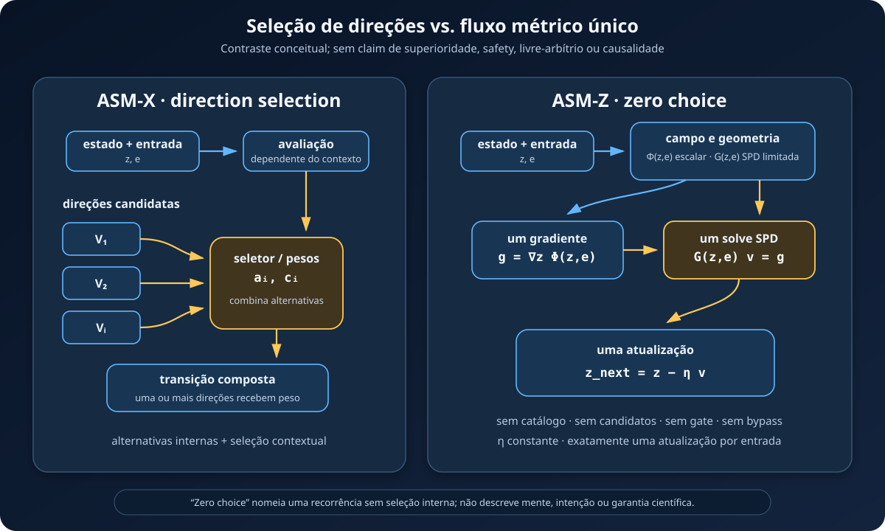

# ASM-Z: arquitetura de fluxo único sem escolha interna

> **Status:** arquitetura experimental implementada no caminho `sequence_mode: asm_z`; ainda sem resultado confirmatório ATTR-RTG-Z. A preregistration existente permanece em rascunho e não foi alterada por este documento.

[Versão PNG 1200×720](figures/asm_z_zero_choice_flow.png)

## Resumo em linguagem simples

O ASM-X organiza a transição por **direções candidatas**: calcula alternativas internas e seleciona ou pondera como elas participam da atualização.

O ASM-Z usa outra construção. A entrada condiciona um campo escalar e uma geometria. O modelo calcula um único gradiente, resolve um único sistema métrico e segue o fluxo resultante. Não existe catálogo de direções no ASM-Z. Também não existem candidatos `V_i`, pesos `a_i` ou `c_i`, votação, `top-k` ou soma de alternativas.

“Escolha zero” é um nome operacional para essa ausência de seleção interna na transição. Não significa mente sem escolhas, consciência, intenção ou livre-arbítrio. ASM-Z continua sendo uma função parametrizada, treinada por otimização numérica.

A filosofia serve apenas como **motivação e metáfora** para uma pergunta de engenharia: o que muda quando uma transição por alternativas é substituída por um fluxo métrico único? A filosofia não é resultado científico e a equação não a demonstra.

## Escopo e não-claims

Esta arquitetura não implica que ASM-Z:

- seja superior ao ASM-X ou a Transformers;
- seja mais seguro, alinhado, consciente ou autônomo;
- tenha livre-arbítrio real ou elimine escolhas em sentido filosófico;
- identifique causas, efeitos causais ou *causal understanding*;
- tenha melhor qualidade, eficiência, estabilidade ou generalização.

Qualquer resultado futuro deve ficar limitado às métricas, dados, escalas e controles realmente medidos.

## ASM-X: seleção de direção

Uma abstração conceitual do ASM-X parte do estado `z`, da entrada `e` e de direções candidatas internas. Um mecanismo dependente do contexto avalia, seleciona ou pondera essas direções para formar a transição.

Essa descrição serve somente para destacar o contraste estrutural. A definição efetiva de um braço ASM-X continua sendo o código e a configuração versionados usados no experimento correspondente.

## ASM-Z: equação de escolha zero

A transição estrita é

\[
\boxed{
z_{\mathrm{next}}
= z-\eta\,G(z,e)^{-1}\nabla_z\Phi(z,e)
}
\]

O potencial implementado é uma única função escalar:

\[
\boxed{
\Phi(z,e)=\phi_\theta(z,e)+\frac{\lambda}{2}\lVert z\rVert_2^2
}
\]

`φ_θ(z,e)` é o componente aprendido e condicionado por estado e entrada. `λ` é uma constante global da configuração; o valor candidato atual é `0.01`. Esse valor ainda pertence à configuração experimental e não deve ser tratado como resultado ou hiperparâmetro confirmatório congelado.

O termo quadrático faz parte de `Φ`. Portanto, sua contribuição `λz` aparece dentro de `∇_z Φ`; ela não é uma correção aplicada depois do fluxo, uma segunda atualização ou um bypass.

Na implementação numérica, não se deve formar a inversa. Define-se

\[
g=\nabla_z\Phi(z,e),
\qquad
G(z,e)v=g,
\qquad
z_{\mathrm{next}}=z-\eta v.
\]

Os termos são:

- `z`: estado corrente;
- `e`: embedding da entrada corrente;
- `Φ(z,e)`: potencial escalar total, composto por `φ_θ(z,e)` e pelo termo quadrático interno;
- `λ`: coeficiente global fixo do termo quadrático, candidato atual `0.01`;
- `∇_z Φ(z,e)`: um único gradiente em relação ao estado;
- `G(z,e)`: métrica simétrica positiva definida, condicionada por estado e entrada;
- `v`: única direção de fluxo, obtida por uma única solução linear;
- `η`: passo global do fluxo.

O fluxo é único porque `v` é determinado diretamente pelo potencial e pela métrica para o par `(z,e)`. Ele não é escolhido de uma lista. “Zero” não quer dizer vetor nulo: em geral `v ≠ 0` e o estado muda.

## Invariantes estritos de escolha zero

Uma execução só pode receber o nome ASM-Z estrito quando todos os invariantes abaixo forem satisfeitos.

1. **Sem catálogo:** não há catálogo explícito ou oculto de direções, bases candidatas ou ações internas.
2. **Sem candidatos:** são proibidos `V_i`, `a_i`, `c_i`, logits de opção, índices vencedores e somas sobre alternativas.
3. **Potencial escalar único:** cada passo avalia uma única função `Φ(z,e)=φ_θ(z,e)+(λ/2)‖z‖²`, com `λ` global e fixo na configuração. O termo quadrático integra o potencial; potenciais concorrentes, correções externas ou termos selecionados violam a definição.
4. **Gradiente único:** o campo de descida é `∇_z Φ(z,e)`, calculado em relação ao estado corrente, sem gate por token ou estado.
5. **Métrica SPD limitada:** `G(z,e)=diag(d)+UUᵀ`, com `d_min ≤ d_j ≤ d_max` e `‖U‖_F ≤ u_bound`. Portanto, `d_min ≤ λ(G) ≤ d_max + u_bound²`, usando limites globais publicados.
6. **Uma solução métrica por entrada:** há exatamente uma solução de `Gv=g` para cada entrada. Não há subpassos, banco de solves, seleção posterior ou mistura de soluções.
7. **Sem inversa explícita:** a implementação usa Woodbury para a estrutura `diag(d)+UUᵀ` e resolve apenas o sistema reduzido necessário. `G^{-1}` na equação é notação matemática.
8. **Passo constante:** `η` é uma constante global publicada. Não há agenda, passo aprendido, multiplicador `ρ`, clipping ou trust scalar.
9. **Uma atualização por entrada:** cada embedding de entrada produz exatamente uma aplicação de `z_next = z - ηv`; múltiplos subpassos são proibidos.
10. **Sem roteamento condicional:** não há `argmax`, amostragem, `top-k`, máscara, early exit, mixture-of-experts ou caminho condicionado por estado/token dentro da recorrência.
11. **Sem bypass:** residual de token para estado, memória paralela, atenção lateral, seletor legado ou outra escrita de estado que contorne o fluxo são proibidos.
12. **Uma atualização de estado:** a única escrita recorrente é exatamente `z_next = z - ηv`, sem outro termo ou pós-processamento.
13. **Determinismo da recorrência:** para pesos, estado e entrada fixos, a transição produz o mesmo resultado dentro da tolerância numérica publicada; dropout na recorrência é proibido.
14. **Falha fechada de nomenclatura:** se qualquer invariante falhar, o braço deve ser marcado como não conforme e não pode ser reportado como ASM-Z estrito.

Esses invariantes definem uma propriedade de arquitetura que pode ser testada. Eles não atribuem significado semântico ao gradiente e não identificam uma causa no mundo.

## Métrica condicionada e limites

Condicionar `G` por `(z,e)` permite mudar a geometria local sem criar alternativas discretas. A métrica pode alongar ou contrair componentes do gradiente, mas deve continuar SPD e respeitar os limites globais.

Os limites espectrais têm função numérica e definicional:

- `d_min > 0` fornece o limite inferior e impede singularidade no solve;
- `d_max + u_bound² < ∞` limita a métrica completa, pois `λ_max(UUᵀ) ≤ ‖U‖_F²`;
- o número de condição deve ser monitorado;
- violações devem ser registradas como falha de conformidade, não ocultadas por seleção de exemplos.

A parametrização atual limita tanto a diagonal quanto a norma de `U`. Limitar somente a parte diagonal não seria suficiente para garantir o limite superior da métrica completa.

## O que permanece aprendível

Escolha zero não congela o modelo. Os parâmetros de `Φ`, de `G`, dos embeddings e do emissor podem ser treinados. Portanto:

- o fluxo continua dependente de `z`, `e` e dos parâmetros;
- entradas diferentes podem produzir atualizações diferentes;
- a perda ainda orienta updates dos parâmetros;
- ausência de seletor não é ausência de comportamento aprendido;
- efeitos observados podem vir do pacote completo de parametrização e otimização.

## Comparação conceitual

| Aspecto | ASM-X: *direction selection* | ASM-Z: *zero choice* |
|---|---|---|
| Objeto intermediário | direções candidatas | campo escalar e métrica local |
| Regra de transição | seleção ou ponderação | um gradiente e um solve SPD |
| Alternativas internas | presentes | ausentes |
| Gates por estado/token | possíveis conforme a versão | proibidos na recorrência estrita |
| Atualização | composição de direções | `z - ηv`, com `Gv=∇Φ` |
| Interpretação válida | roteamento direcional | fluxo métrico único |
| Interpretação inválida | “decisão consciente” | “sem livre-arbítrio”, “causal” ou “seguro” |

A tabela descreve uma diferença, não uma ordem de mérito. A seleção de ASM-X e a restrição de ASM-Z são hipóteses arquiteturais distintas. Só uma avaliação pareada pode medir seus efeitos práticos.

## Implementação atual

O repositório contém um caminho experimental ASM-Z com potencial escalar `Φ=φ_θ+(λ/2)‖z‖²`, métrica condicionada `diag(d)+UUᵀ`, solve por Woodbury e recorrência dedicada. O candidato de configuração atual fixa `λ=0.01`; todo o termo quadrático é diferenciado como parte de `Φ`, sem atualização ou bypass adicional. A implementação não equivale a evidência empírica e não torna o draft ATTR-RTG-Z congelado.

Antes de um braço ser aceito como ASM-Z estrito, testes de conformidade devem verificar os limites `d_min` e `d_max + u_bound²` da métrica completa, o solve único por entrada, a ausência de gates e bypasses, o passo constante e uma atualização por entrada. Uma violação é trabalho pendente, não licença para relaxar a definição.

## Experimento real: ATTR-RTG-Z

O estudo real proposto compara **ASM-Z versus Transformer com parâmetros e updates pareados**. O ASM-X serve aqui apenas para explicar a diferença conceitual e não é um braço confirmatório.

O protocolo deve operacionalizar antes do teste final:

- parâmetros treináveis iguais dentro da tolerância declarada;
- mesmo número de updates de otimização;
- mesmos dados, splits, tokenizer, sequência, batch efetivo e ordem de exemplos;
- mesmo otimizador e política de learning rate, salvo diferenças preregistradas;
- seeds correspondentes e checkpoints equivalentes;
- compute, memória e tempo reportados separadamente, pois parâmetros e updates pareados não garantem FLOPs iguais;
- métricas, baselines, intervalos, multiplicidade e critérios de decisão definidos no protocolo próprio;
- testes obrigatórios dos invariantes ASM-Z antes da elegibilidade do braço.

Esse ATTR-RTG-Z é um estudo novo. Resultados históricos de ASM-X não são resultados de ASM-Z. O nome também não deve ser confundido com o gate histórico `RTG1-Z`. Esta documentação não congela, autoriza ou modifica a preregistration.

O contraste mede o efeito do **pacote arquitetural** nas condições registradas. Mesmo uma diferença robusta não isola causalmente o potencial, a métrica ou a recorrência; não prova safety, livre-arbítrio, consciência ou superioridade universal.

## Leitura correta da figura

O lado ASM-X mostra alternativas direcionais chegando a um seletor. O lado ASM-Z mostra entrada e estado produzindo um potencial escalar e uma métrica SPD, seguidos por um único gradiente, um único solve e uma única atualização. A figura não mostra — e ASM-Z não contém — catálogo, votação ou soma de candidatos.
