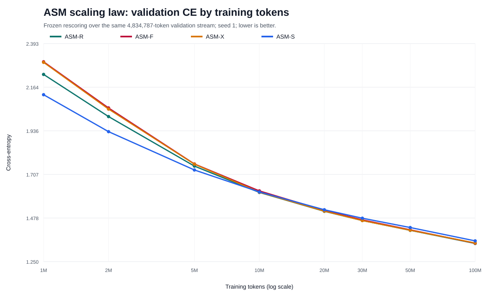
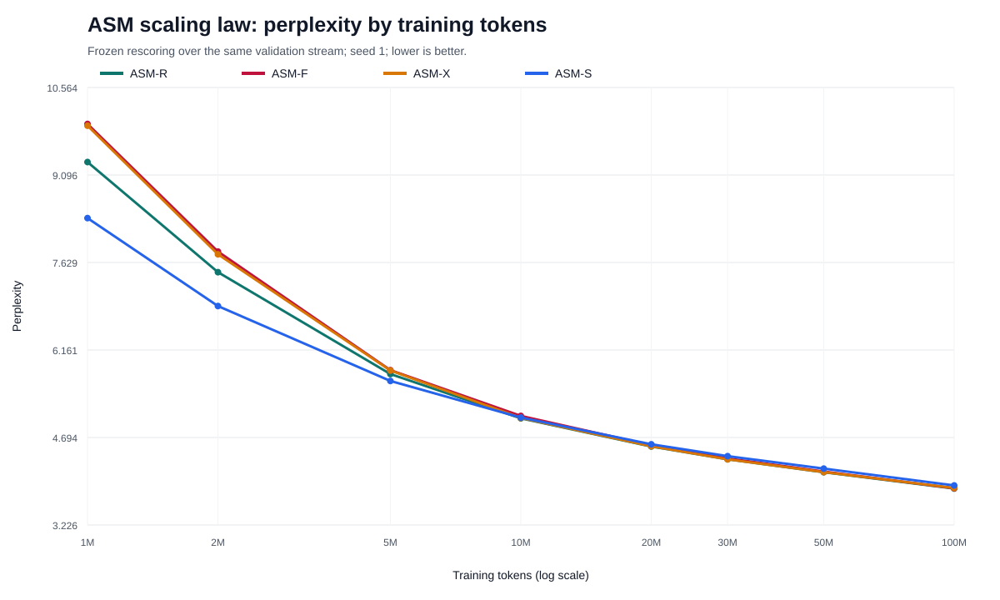
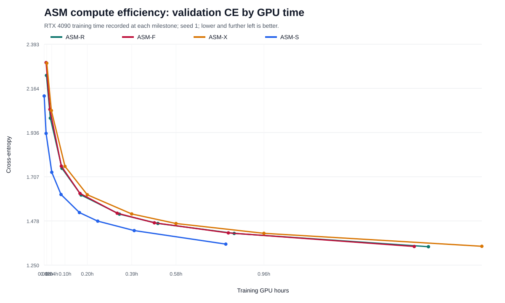
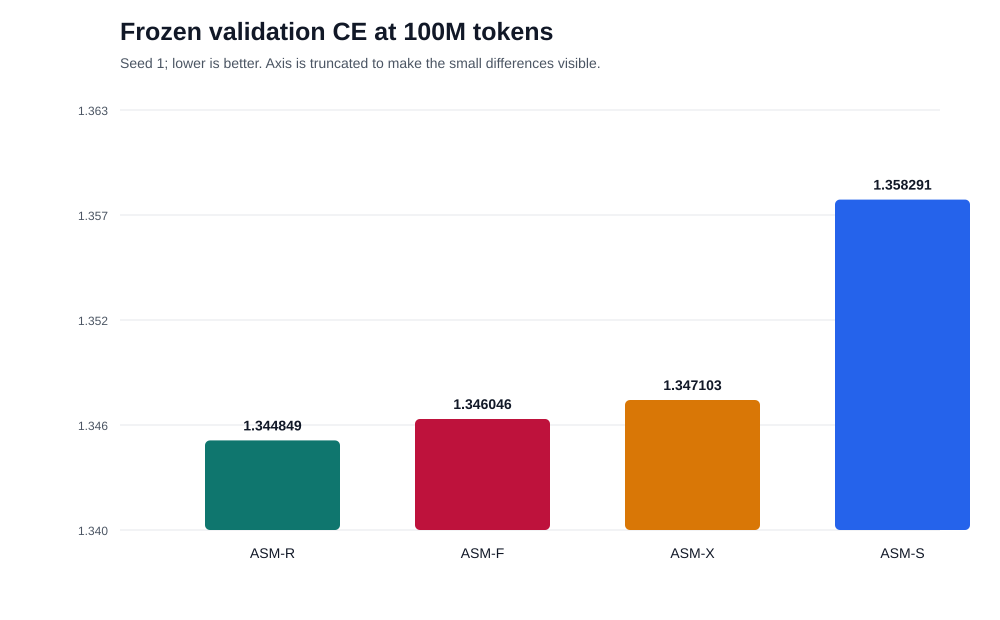

# ASM scaling law — 100M tokens, seed 1

This directory preserves the lightweight, reproducible artifacts from the ASM
scaling-law run completed on July 31, 2026.

## Protocol

- Training data: Wikipedia byte-token memmap
- Validation manifest SHA-256:
  `4adabd5a6a64c30bda37ec23fd2db0341421995f6cdf516f46757e49c1948c07`
- Sequence length: 512
- Precision: BF16
- Device: NVIDIA RTX 4090 / CUDA
- Seed: 1
- Milestones: 1M, 2M, 5M, 10M, 20M, 30M, 50M, and 100M tokens
- Frozen validation tokens per milestone: 4,834,787
- Source commit: `2c56203ea973c68feca38d54f60bbc7ed49717bb`

Every milestone was rescored over the same continuous validation sequence. The
sampled `best_val_ce` values in the training summaries are retained as provenance
but must not be used for architecture ranking.

## Result at 100M tokens

| Variant | ASM name | Parameters | Validation CE | PPL | GPU hours |
|---|---|---:|---:|---:|---:|
| `J_NO_DIRECTION` | ASM-R | 83,206,400 | **1.344849** | **3.8376** | 1.6762 |
| `J_METRIC_ORTHONORMAL_DIRECTION` | ASM-F | 126,080,896 | 1.346046 | 3.8422 | 1.6145 |
| `J` | ASM-X | 126,080,896 | 1.347103 | 3.8463 | 1.9080 |
| `J_DIRECT_CONTROL_MATCHED` | ASM-S | 83,206,700 | 1.358291 | 3.8895 | **0.7965** |

ASM-R achieved the lowest CE per training token. ASM-S processed 100M tokens in
less than half the time required by ASM-R and is the compute-efficiency winner.
ASM-F was the strongest explicit-direction formulation. The experiment contains
one seed, so promotion is provisional even though the ordering is consistent with
earlier paired ablations.

## Charts

### Validation CE by training tokens

### Perplexity by training tokens

### Validation CE by GPU time

### Final validation CE at 100M tokens

The token curves use a logarithmic horizontal axis. The final bar chart uses a
truncated CE axis because all four models finish within 0.014 CE of one another.

## Files

- `scaling_law_summary.json`: frozen scores, timings, fitted curves, checkpoint
  hashes, environment metadata, and observed crossovers.
- `ablation_manifest.json`: exact training commands and parameter counts.
- `configs/`: resolved model configuration for each variant.
- `training_summaries/`: final trainer summaries retained for provenance.
- `charts/`: reproducible SVG plots and their source CSV table.

Large checkpoints remain under the ignored local `runs/` directory and are not
committed to Git.

The scientific interpretation is documented in
`docs/report/033_Resultado_Scaling_Law_ASM_100M_2026_07_31.md`.
