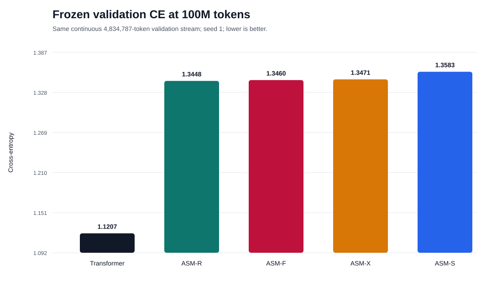
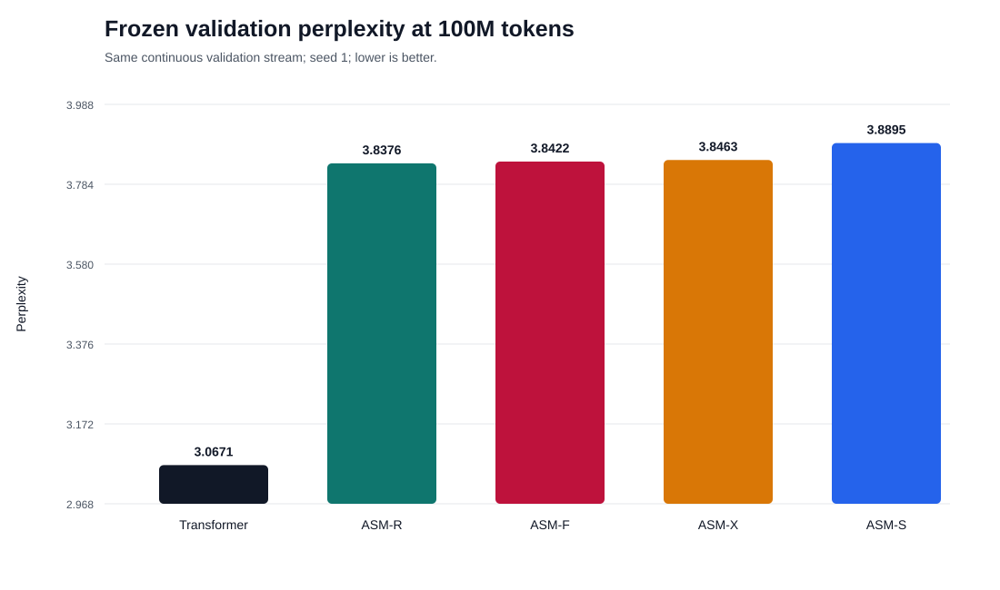
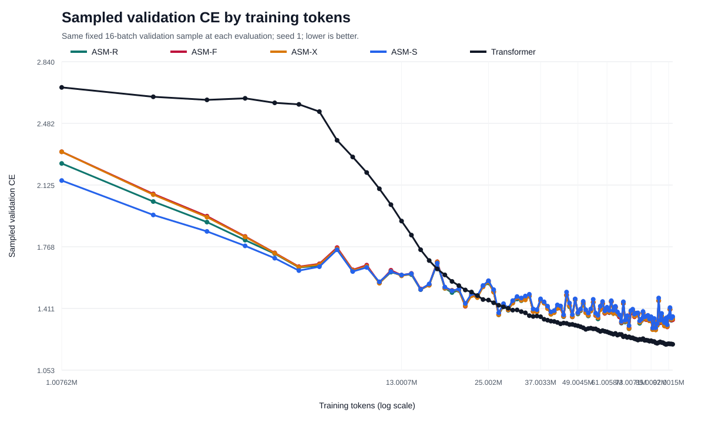
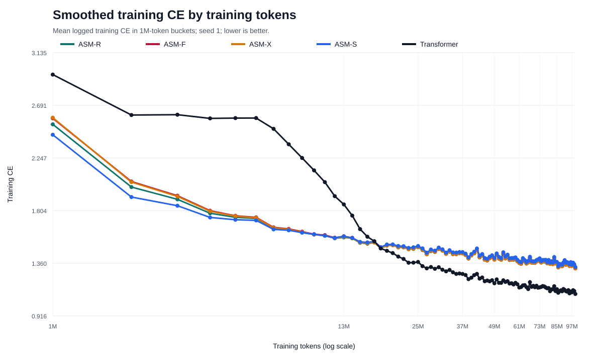
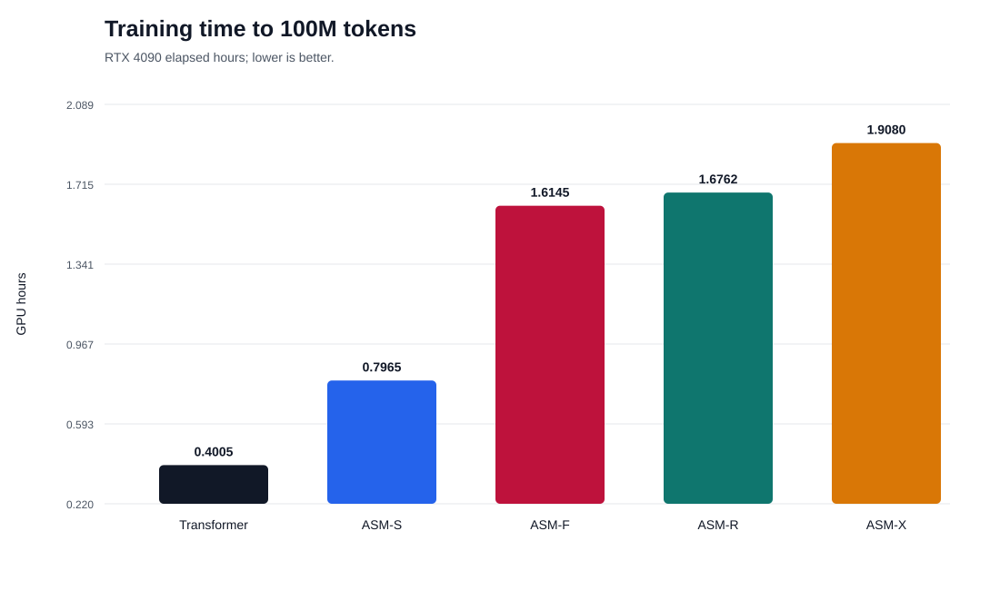
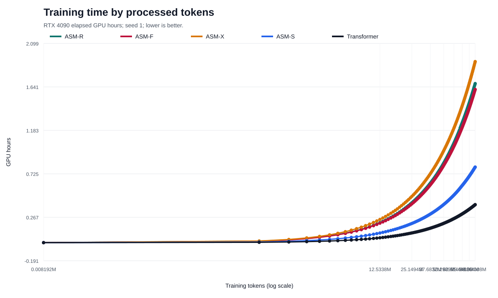
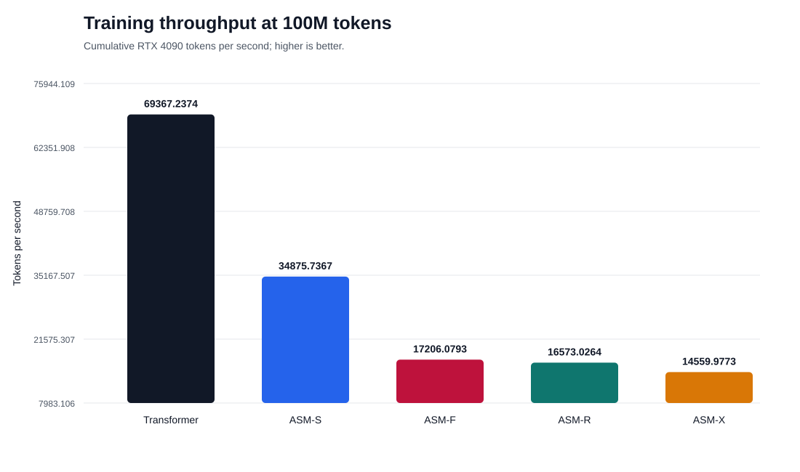
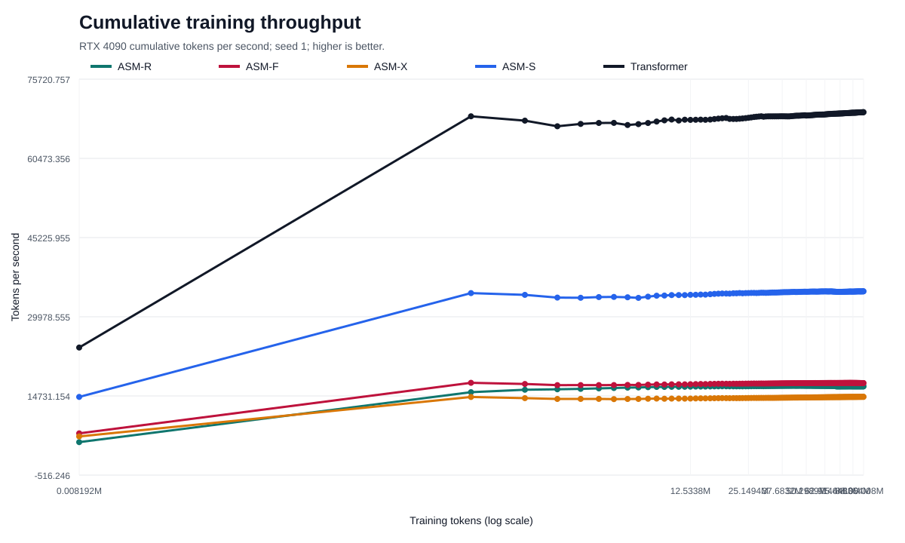
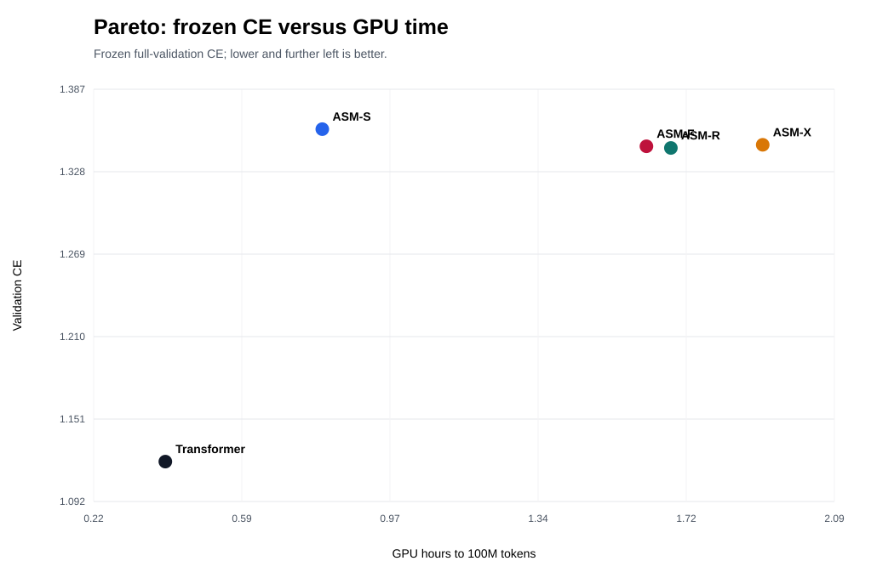
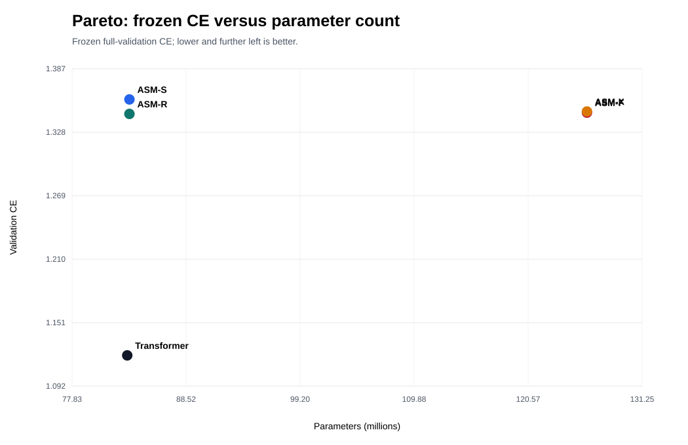

# ASM versus Transformer — 100M tokens, seed 1

## Resultado final comparável

Todos os valores de CE e perplexidade desta tabela foram calculados sobre a
mesma sequência contínua de 4.834.787 tokens de validação.

| Modelo | Parâmetros | CE | PPL | GPU h | tokens/s |
|---|---:|---:|---:|---:|---:|
| Transformer | 83.001.240 | **1,120721** | **3,0671** | **0,4005** | **69.367** |
| ASM-R | 83.206.400 | 1,344849 | 3,8376 | 1,6762 | 16.573 |
| ASM-F | 126.080.896 | 1,346046 | 3,8422 | 1,6145 | 17.206 |
| ASM-X | 126.080.896 | 1,347103 | 3,8463 | 1,9080 | 14.560 |
| ASM-S | 83.206.700 | 1,358291 | 3,8895 | 0,7965 | 34.876 |

O Transformer obteve CE 0,224128 menor que o ASM-R, redução relativa de 16,67%,
com aproximadamente 4,19 vezes o throughput e 23,91% do tempo de treino.
Este resultado é de uma seed e não substitui confirmação multiseed.

## Qualidade final





## Curvas de aprendizado

As curvas abaixo usam a mesma amostra fixa de 16 batches a cada avaliação.
Elas permitem comparar a trajetória do treinamento, mas a tabela final acima,
baseada no rescoring integral, é a referência para a conclusão.





## Eficiência computacional









## Fronteiras de Pareto





## Reprodutibilidade

Os números usados nos gráficos estão em `charts/final_metrics.csv`. Para
regenerar todos os SVGs:

```bash
.venv/bin/python scripts/plot_100m_model_comparison.py
```

O Transformer e o ASM-R possuem orçamento de parâmetros praticamente pareado:
a diferença é de 205.160 parâmetros, ou 0,247%. ASM-F e ASM-X são maiores e
continuam no gráfico porque fazem parte da scaling law original de 100M tokens.
