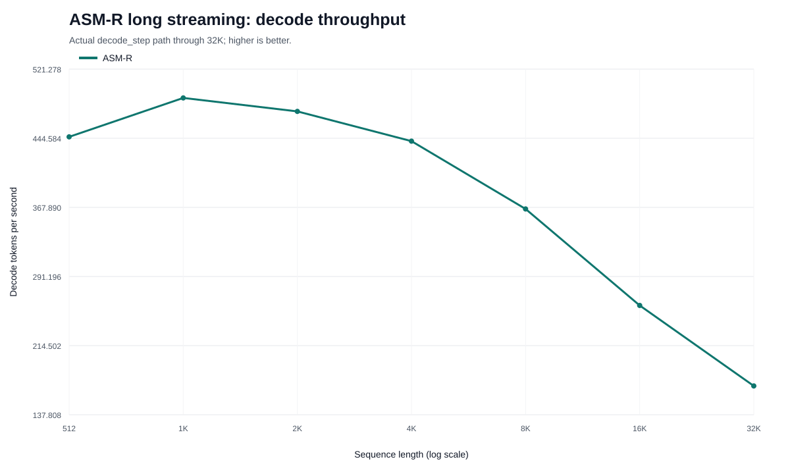
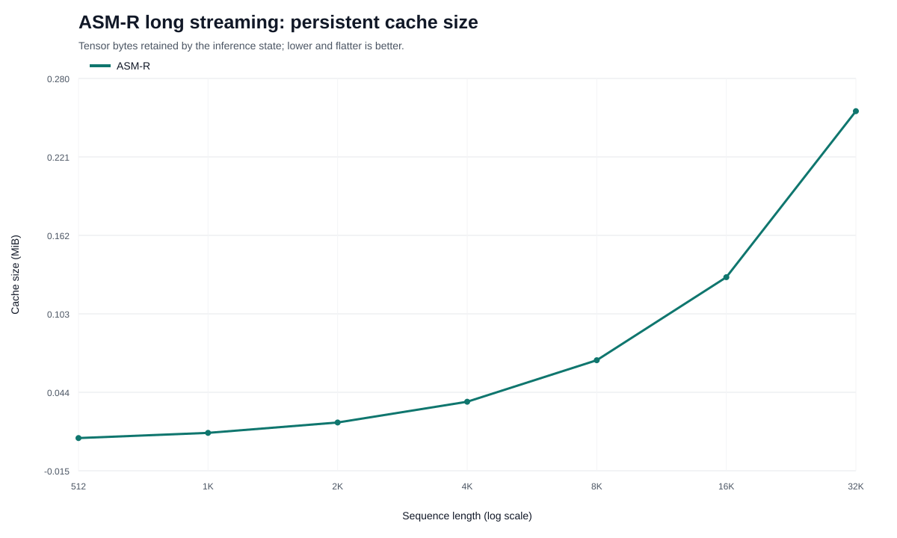
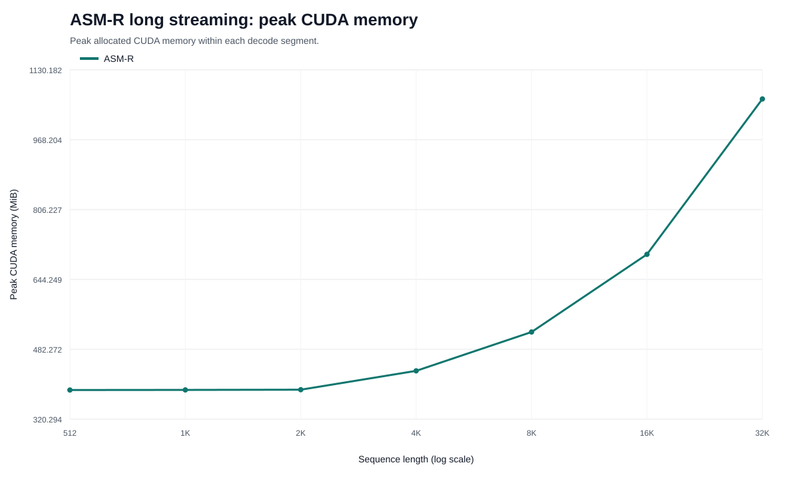
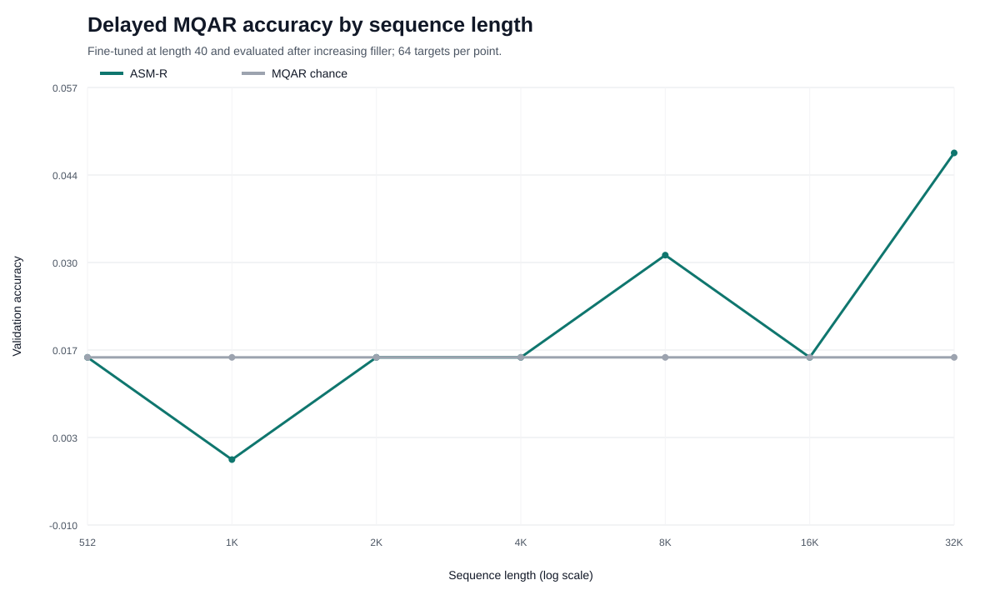
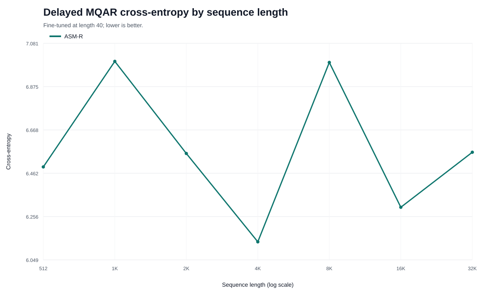

# Resultado do streaming longo ASM-R até 32K

## Resultado executivo

O ASM-R processou uma sequência de 32.768 tokens sem OOM e sem estado inválido.
Isso confirma extensão operacional além do contexto de treino de 512. A suíte,
porém, rejeitou memória e latência estritamente constantes na implementação
atual, e não demonstrou retenção associativa longa.

## Streaming observado

| Comprimento | Decode tok/s | Cache MiB | CUDA atual MiB | Pico MiB |
|---:|---:|---:|---:|---:|
| 512 | 446,1 | 0,0098 | 331,2 | 387,8 |
| 1K | 489,3 | 0,0137 | 331,4 | 388,0 |
| 2K | 474,4 | 0,0215 | 331,9 | 388,5 |
| 4K | 441,4 | 0,0371 | 332,9 | 432,3 |
| 8K | 366,1 | 0,0684 | 335,0 | 522,3 |
| 16K | 259,1 | 0,1309 | 339,0 | 702,4 |
| 32K | 169,8 | 0,2559 | 347,2 | 1.062,7 |

Entre 1K e 32K, o throughput caiu 65,3%. O cache persistente é pequeno, mas
linear: ele conserva os IDs do prefixo. A alocação CUDA permanente aumentou
apenas cerca de 16 MiB, enquanto o pico temporário cresceu aproximadamente
675 MiB. O emitter proporcional ao prefixo explica a maior parte dessa diferença.

## MQAR distante

| Comprimento | CE | Acurácia | Targets |
|---:|---:|---:|---:|
| 512 | 6,4921 | 1,5625% | 64 |
| 1K | 6,9949 | 0% | 64 |
| 2K | 6,5561 | 1,5625% | 64 |
| 4K | 6,1352 | 1,5625% | 64 |
| 8K | 6,9898 | 3,1250% | 64 |
| 16K | 6,2999 | 1,5625% | 64 |
| 32K | 6,5620 | 4,6875% | 64 |

O acaso entre os 64 valores candidatos é 1,5625%. As oscilações observadas não
são significativas com apenas 64 targets por ponto. A CE também ficou acima de
`ln(256) ≈ 5,545`, indicando previsões frequentemente confiantes e erradas.

Existe uma limitação de protocolo: a adaptação ocorreu em comprimento 40, mas a
suíte não avaliou um controle pós-adaptação nesse mesmo comprimento. Portanto,
ela comprova ausência de recuperação longa, mas não distingue entre falha de
aprendizado curto e esquecimento causado pelo filler.

## Veredito por hipótese

| Hipótese | Resultado |
|---|---|
| Executar 32K sem OOM | confirmada |
| Estado persistente pequeno | confirmada |
| Cache estritamente constante | rejeitada |
| Throughput constante | rejeitada |
| Pico de VRAM constante | rejeitada |
| Retenção MQAR longa | não demonstrada |

Os dados brutos permanecem em `runs/asm_r_long_streaming_32k/results.json`. Os
CSV e SVG deste relatório são regenerados com `scripts/plot_asm_r_long_streaming.py`.
