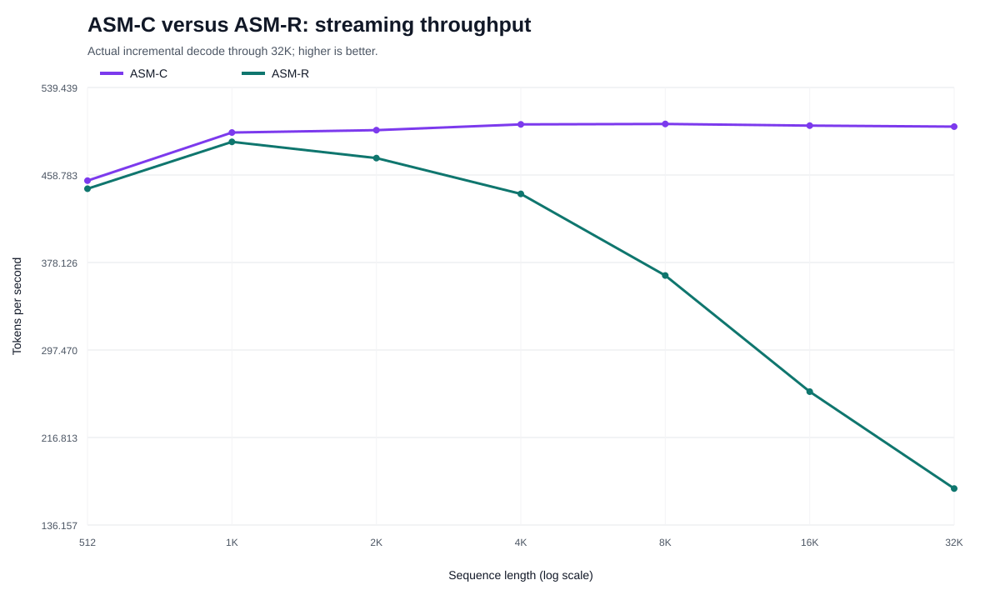
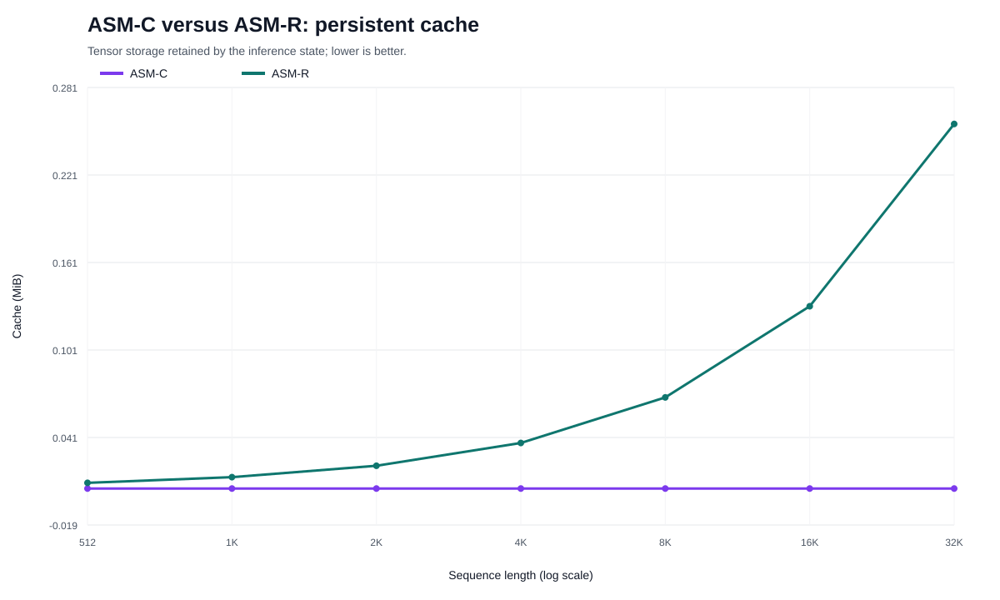
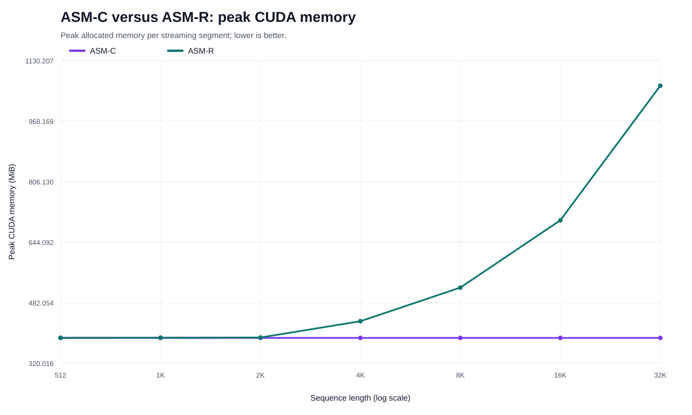
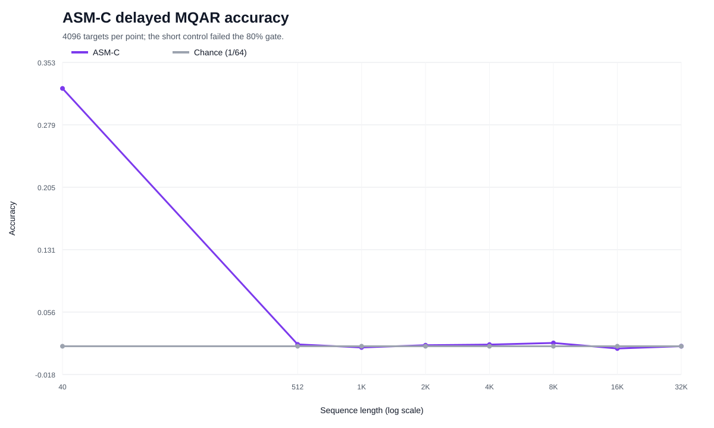
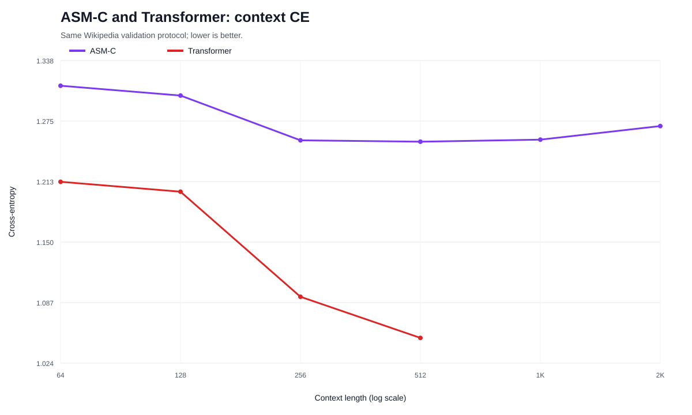
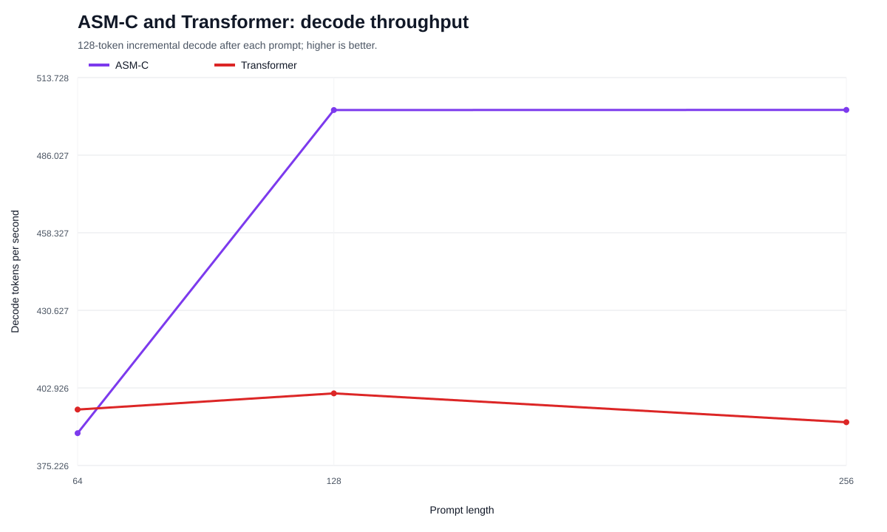

# Resultado da validação ASM-C — streaming compacto até 32K

## Resumo executivo

A suíte confirmou a principal correção de engenharia do ASM-C: o estado de
inferência permaneceu compacto, a VRAM não cresceu com o comprimento acumulado
e o throughput ficou estável até 32K tokens.

Ao mesmo tempo, o modelo falhou no controle curto de MQAR. Portanto, este
experimento demonstra **streaming compacto**, mas não demonstra **memória
associativa de longo alcance**.

Esta distinção é essencial:

> ASM-C consegue continuar computando sem carregar o prefixo completo, mas
> ainda não demonstrou que preserva e recupera corretamente as informações
> relevantes desse prefixo.

## Protocolo

- checkpoint: ASM-R seed 1 treinado até 100M tokens;
- GPU: NVIDIA RTX 4090;
- precisão da paridade: BF16;
- comprimentos streaming: 512, 1K, 2K, 4K, 8K, 16K e 32K;
- MQAR: 5.000 passos de adaptação;
- controle MQAR: sequência de 40 tokens;
- avaliação MQAR: 4.096 targets por comprimento;
- comparação: caminho ASM-R anterior e Transformer pareado de 100M tokens.

## Resultado de streaming

O cache ASM-C permaneceu em `6.144 bytes` em todos os comprimentos. O pico de
VRAM permaneceu em `387,53 MiB`, e o throughput variou de `453,6 tok/s` em 512
para `503,4 tok/s` em 32K.

No intervalo usado pelo gate, 4K→32K, a retenção de throughput foi `99,6%`.
Comparado com o ASM-R anterior em 32K:

- speedup: `2,97x`;
- redução do cache persistente: `97,71%`;
- redução do pico de VRAM medido: `63,53%`;
- ASM-R: `169,8 tok/s`, `268.288 B`, `1.062,7 MiB`;
- ASM-C: `503,4 tok/s`, `6.144 B`, `387,5 MiB`.

## Paridade BF16

Em 512 posições decodificadas:

- erro absoluto médio dos logits: `0,008416`;
- erro absoluto máximo: `0,25`;
- divergências de argmax: `3/512` (`0,586%`).

O resultado indica proximidade numérica, mas não equivalência bit a bit. Como
uma divergência inicial pode mudar toda uma amostragem autoregressiva, o erro
máximo e a taxa de argmax devem permanecer explícitos.

## MQAR: gate reprovado

O controle de 40 tokens obteve apenas `32,25%` de acurácia, com intervalo de
confiança de 95% entre `30,84%` e `33,70%`. O critério exigia `80%`.

As avaliações longas ficaram aproximadamente entre `1,3%` e `2,0%`, próximas
do acaso de `1/64 = 1,5625%`. Entretanto, não é metodologicamente correto dizer
que o ASM-C “esqueceu” em longa distância: o controle prova que ele ainda não
aprendeu suficientemente a tarefa nem em curta distância.

## Comparação com Transformer

O Transformer obteve CE menor em todos os comprimentos compartilhados até 512.
O ASM-C executou avaliação em 1K e 2K, enquanto o checkpoint Transformer
pareado possui embeddings posicionais aprendidos limitados a 512. Isso mostra
uma vantagem operacional sobre **este checkpoint**, não sobre Transformers em
geral.

No decode incremental, o ASM-C ficou próximo ou acima do Transformer depois de
prompts de 128 e 256 tokens. No prefill, o Transformer permaneceu claramente
mais rápido nos comprimentos compartilhados maiores.

## Decisão científica

O ASM-C passou a prova de estrutura compacta, mas não deve ser promovido como
solução de memória longa. A formulação pública correta neste estágio é:

> ASM-C é uma forma de inferência recorrente compacta do ASM-R, com cache, VRAM
> e throughput empiricamente limitados até 32K nesta configuração. Sua
> capacidade de retenção associativa permanece não demonstrada.

## Próximo experimento

Antes de repetir distâncias longas, é necessário resolver o aprendizado MQAR
curto:

1. executar curvas de adaptação em 5K, 10K e 20K passos somente no controle de
   40 tokens;
2. comparar taxas de aprendizado e tamanhos de lote;
3. incluir ASM-C sem memória seletiva, ASM-S e Transformer pequeno pareado;
4. exigir pelo menos 80% no controle curto antes de habilitar comprimentos
   512–32K;
5. somente então medir retenção versus distância.

O próximo problema arquitetural já não é o crescimento do cache. É a capacidade
do estado compacto aprender o que deve preservar e recuperar.
